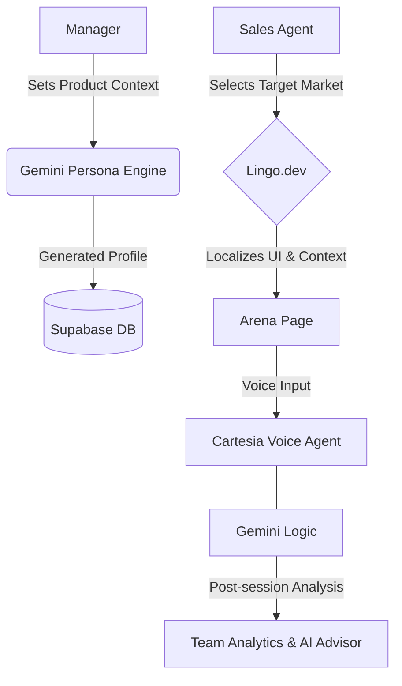
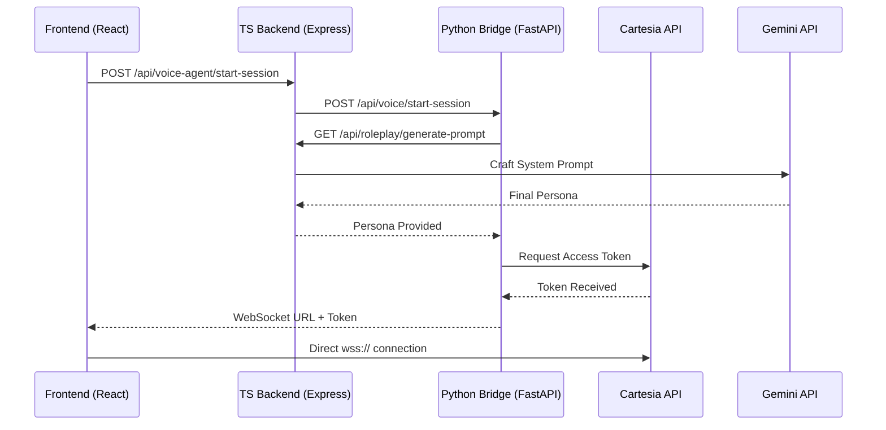

# LingoPitch: AI-Powered Sales Intelligence and Cultural Hardening

LingoPitch is a **Universal Sales Hardening Platform** designed to prepare sales teams for any global market from a single interface. Instead of forcing teams to adapt to a "one-size-fits-all" Western sales methodology, LingoPitch uses AI to adapt its behavior to the localized business norms of your customer.

The platform integrates **Cartesia's ultra-low latency voice** with **Gemini's strategic intelligence** and **Lingo.dev's cultural localization** to facilitate high-stakes sales conversations in multiple languages against dynamically generated cultural personas.

---

## Try the App Live
You can access the production environment here:
**[https://sublime-nature-production.up.railway.app/](https://sublime-nature-production.up.railway.app/)**

---

## The Problem: The "Culture Gap"
In international sales, knowing the language is not enough. Many deals are lost not because of *what* was said, but **how** it was said. We call this the "Culture Gap."

Most sales training forces everyone to use the same Western methods. LingoPitch does the opposite: it trains you to meet the customer where they are.

Sales reps often struggle because:
- **Style Clashes:** Being too direct can feel rude in some cultures, while being too vague can feel untrustworthy in others.
- **Tone-Deafness:** Focusing purely on money works in some markets, but building a personal relationship is the only way to win in others.
- **The Accent Barrier:** It is difficult to understand different regional accents in real-time without safe practice.
- **High Stakes:** Learning on the job with real customers is risky and expensive.

**LingoPitch provides a "High-Fidelity Cultural Simulator"—a safe place where you can fail for free and sharpen your instincts before your first real meeting.**

---

### One Platform, Many Cultures: Before vs. After
*How LingoPitch changes the way you sell globally.*

| Feature | **Traditional Sales Training** | **LingoPitch Universal Hardening** |
| :--- | :--- | :--- |
| **Methodology** | Forces a single style on every region. | Adapts the AI Customer to act like a real local buyer. |
| **Feedback** | Basic grammar and vocabulary checks. | Deep feedback on **Cultural Tone** and **Etiquette**. |
| **Risk** | You learn by losing real deals. | You learn by "failing for free" in a simulator. |
| **Outcome** | **Friction.** Customers feel misunderstood. | **Trust.** You sound like a local partner, not a stranger. |

---

## Demo and Overview
> [!NOTE]
> *Space reserved for YouTube Walkthrough Video*
> 

---

## Lingo.dev: The Cultural Intelligence Core

Cultural resonance is treated as a core architectural layer rather than a secondary feature. Through the integration of Lingo.dev and specialized prompt engineering, the following capabilities are achieved:

- **Real-time UI Localization:** The entire interface, including mission briefings and persona profiles, is dynamically localized using the Lingo.dev SDK to ensure complete immersion.
- **Regional Behavioral Hardening:** AI personas are injected with regional business norms, local idioms, and specific cultural taboos. A "Discovery Call" in Tokyo is designed to feel fundamentally different from one in New York.
- **Cultural Accuracy Scoring:** Every session is evaluated by Gemini against a specialized rubric:
    1. **Cultural Appropriateness:** Adherence to regional business etiquette.
    2. **Language Formality:** Correct usage of formal/informal address (e.g., T-V distinction).
    3. **Relationship Sensitivity:** Balance of rapport-building vs. transaction-focus.
    4. **Protocol Adherence:** Respect for local decision-making hierarchies.

---

## Key Features

### 1. The Arena (Voice-to-Voice Simulation)
- **Cartesia Voice Agent:** Sub-200ms latency for natural, flowing conversations.
- **Dynamic Regional Personas:** Customers adapt behavior based on region (e.g., blunt ROI-focused German vs. polite British director).
- **Infinite Objection Handling:** AI pushes back with tough objections and regional negotiation styles.

### 2. Manager Mission Command (Admin Control)
- **Organization Settings:** Define the "Source of Truth" for your product.
- **Persona Recrafting:** Gemini generates deep-dive persona profiles (Pain points, Vibe, ROI-triggers) automatically.
- **Team Monitoring:** Detailed views of individual member performance and detailed rubrics.

### 3. Team Analytics and Progress Tracking
- **Skill Cluster Radar:** Visualizes strengths (Discovery, Value Prop, etc.) across the organization.
- **Performance Leaderboards:** Gamification for top-scoring sales representatives.
- **Executive Summaries:** Auto-generated summaries and actionable coaching tips for every call.

### 4. Cultural Sales Advisor (AI Chat)
- **Full Context Integration:** Chat with an AI that knows your team's history, call transcripts, and specialized sales playbooks.

---

## System Workflow

### User Interaction Flow

### Voice Handshake (Technical)

---

## API Reference (Endpoint Index)

### Infrastructure and Localization
- `GET /api/language/supported`: List all 80+ supported locales.
- `POST /api/language/detect`: Auto-detect language from input text.
- `POST /api/translation/translate`: Real-time text translation.
- `POST /api/translation/ui-strings`: Localize large JSON objects of UI strings.

### Organization and Profiles
- `POST /api/organization/:id/settings`: Update product context and trigger Persona Recrafting.
- `GET /api/profiles/:userId`: Retrieve user stats and Cultural IQ.
- `PATCH /api/profiles/:userId/stats`: Update performance metrics after a session.

### Voice and Roleplay
- `POST /api/roleplay/generate-prompt`: (Gemini) Create the high-fidelity persona system prompt.
- `POST /api/voice-agent/start-session`: Proxies to Python bridge to initialize Cartesia.
- `POST /api/voice-agent/end-session`: Processes audio buffer, transcribes with Gemini, and saves transcripts.

### Analytics and Advisor
- `POST /api/calls`: Manual call analysis creation.
- `GET /api/calls/user/:userId`: User's call history with detailed scores.
- `POST /api/chat`: High-context Sales Advisor Chat (Playbooks + History).
- `POST /api/playbooks/upload`: Index PDF sales playbooks into RAG memory (Supabase).

---

## Codebase Index (File Mapping)

### Folder: backend/src/
- **index.ts**: Main entry point; registers all 12+ API route groups.
- **routes/**: Endpoint definitions for Analytics, Chat, Roleplay, etc.
- **services/**: Core logic layer.
    - analysisService.ts: Post-call performance evaluation logic.
    - chatService.ts: Context loading (Transcripts/Playbooks) for the AI Advisor.
    - roleplayService.ts: Gemini prompt factory for cultural personas.
    - translationService.ts: Lingo.dev SDK wrapper.
- **lib/**: supabase.ts initialization.

### Folder: frontend/src/
- **pages/**: UI Components (Arena, Settings, Team Analytics, Advisor).
- **services/**:
    - api.ts: Typed Fetch wrapper for the backend.
    - cartesiaClient.ts: Direct WebSocket management for ultra-low latency voice.
- **store/**: languageStore.ts (Zustand) managing global locale state.
- **contexts/**: AuthContext.tsx and TranslationContext.tsx.

### Folder: voice-agent/ (Python Bridge)
- **server.py**: FastAPI server acting as a bridge to Cartesia's Hosted Calls API. Handles access token generation and WebSocket streaming URLs.

---

## Tech Stack
- **Frontend**: React 19, Vite, Tailwind CSS, Framer Motion, Zustand.
- **Backend**: Node.js (Express), TypeScript, Gemini 2.5 Flash, Supabase.
- **Voice Agent**: Python (FastAPI), Cartesia AI.
- **Localization**: Lingo.dev SDK.

---

## Installation

1. **Repository Setup:** `git clone https://github.com/singularity-forge/Lingo.Pitch.git`
2. **Environment Configuration:** Configure .env files in frontend, backend, and voice-agent using provided .env.example templates.
3. **Dependency Installation:** `npm install` (Root), `npm install` (Sub-folders), `pip install -r requirements.txt` (Voice Agent).
4. **Execution:** Run services concurrently (Ports 3001, 5173, 8001).

---

## Strategic Roadmap (2026 Focus)

### Current Limitations
- **Non-Verbal Blindness:** Visual cues (body language, gestures) are not currently tracked or analyzed.
- **Hallucination Risk:** The AI may occasionally reference generic regional facts not explicitly present in provided context.
- **Contextual Depth:** Simulations are currently limited to single interactions.

### Roadmap
- **Emotional Intelligence (EQ) Engine:** Analyze tone, pacing, and emotional cues to provide a "Frustration Meter" for the AI customer.
- **Predictive Lead Scoring:** Forecast a rep's actual win-rate based on their roleplay consistency.
- **Real-Time Co-Pilot Mode:** Live overlay that provides "Whisper Coaching" during actual calls.
- **Multi-Party Scenarios:** Simulating sales calls with multiple stakeholders (e.g., CEO and CFO) in the same channel.
- **CRM Deep-Link:** Automated pushing of practice scores to Salesforce or HubSpot.
